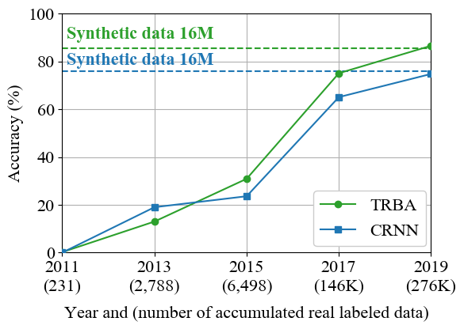
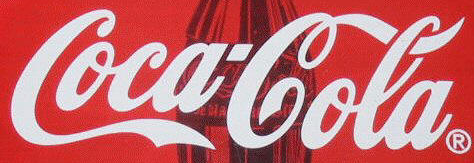
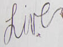
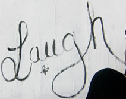
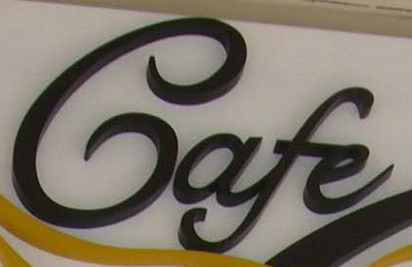
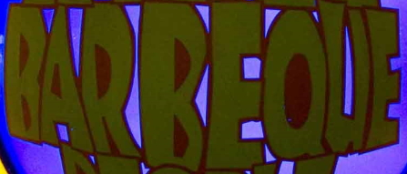
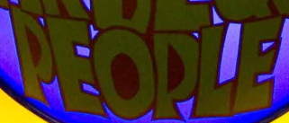

# What If We Only Use Real Datasets for Scene Text Recognition? Toward Scene Text Recognition With Fewer Labels
Official PyTorch implementation of STR-Fewer-Labels | [paper](https://arxiv.org/abs/2103.04400) | [training and evaluation data](https://github.com/ku21fan/STR-Fewer-Labels/blob/main/data.md) | [pretrained model](#pretrained_models) |

**[Jeonghun Baek](https://jeonghunbaek.net/), [Yusuke Matusi](http://yusukematsui.me/), [Kiyoharu Aizawa](http://www.hal.t.u-tokyo.ac.jp/~aizawa/)**

The University of Tokyo.

1. In STR field, **real data was too small < 10K images.** <br>
→ There is Implicit common knowledge “We should use synthetic data, since we don't have enough real data to train models sufficiently.” <br>
→ All state-of-the-art (SOTA) methods use large synthetic data (16M). <br>
→ **Problem: the study of training STR with fewer real labels is insufficient.** If you wonder about the detail, such as why this is a problem, please refer to our paper and supplement.

2. **We disprove the common knowledge by consolidating recently accumulated public real data and showing that we can train STR models sufficiently with fewer real labels (276K = 1.7% of large synthetic data 16M).**
In our work, “sufficiently trained” means that the model has similar accuracy as the model trained on large synthetic data, as shown below figure.

3. Subsequently, as a baseline study of STR with fewer labels, we apply simple data augmentations and semi- and self-supervised learning methods.
As a result, **we obtain a competitive model with only real data, which has better accuracy than the model trained on large synthetic data and similar accuracy to other SOTA methods that use large synthetic data. (see Table 2 in our paper)**

This work is a stepping stone toward STR with fewer labels, and we hope this work will facilitate future work on this topic.




## News
- **Jun 5, 2021**: Initial upload
- **Mar 1, 2021**: The paper is accepted at CVPR2021.

## Getting Started
### Dependency
- This work was tested with PyTorch 1.6.0, CUDA 10.1 and python 3.6.
- requirements : lmdb, pillow, torchvision, nltk, natsort, fire, tensorboard, tqdm

      pip3 install lmdb pillow torchvision nltk natsort fire tensorboard tqdm


### Download preprocessed lmdb dataset for traininig and evaluation 
See [`data.md`](https://github.com/ku21fan/STR-Fewer-Labels/blob/main/data.md)

<h3 id="pretrained_models"> Run demo with pretrained model <a href="https://colab.research.google.com/github/ku21fan/STR-Fewer-Labels/blob/master/demo_in_colab.ipynb" target="_parent"></a> </h3> 

1. [Download pretrained model](https://www.dropbox.com/sh/23adceu2i85c4x1/AACLmaiL43Jy8eYIVVUkZ344a?dl=0) <br>
There are 2 models (CRNN or TRBA) and 5 different settings of each model.

    Setting | Description
    -- | --
    Baseline-synth | Model trained on 2 synthetic datasets (MJSynth + SynthText)
    Baseline-real | Model trained on 11 real datasets (Real-L in Table 1 of our paper)
    Aug | Best augmentation setting in our experiments
    PL | Combination of Aug and Pseudo-Label (PL)
    PR | Combination of Aug, PL and RotNet

2. Add image files to test into `demo_image/`
3. Run demo.py
   ```
   CUDA_VISIBLE_DEVICES=0 python3 demo.py --model_name TRBA --image_folder demo_image/ \
   --saved_model TRBA-Baseline-real.pth
   ```

#### prediction results
| demo images | [TRBA-Baseline-synth](https://www.dropbox.com/sh/23adceu2i85c4x1/AAB-AANFt__wvVvBowXgkfwka/TRBA-Baseline-synth.pth?dl=0) | [TRBA-Baseline-real](https://www.dropbox.com/sh/23adceu2i85c4x1/AABEIFnvyoTfFxwb2hJAm-q6a/TRBA-Baseline-real.pth?dl=0) |
| ---         |     ---      |          --- |
|     |   (ccaloola. | Coca-Cola   |
|     |   Line       | Hire        |
|     |   Lugh       | Laugh       |
|     |   Gaf        | Cafe        |
|     |   upbege     | BARBREQUE   |
|     |   PEOPLE     | PEORLE      |
|     |   Esciting   | ExCiting    |
|     |   Signs      | Signs       |
|     |   BALLY      | BALLYS      |
|    |   SHAKESHACK | SHAKE SHACK |


### Training
1. Train CRNN model with only real data.

       CUDA_VISIBLE_DEVICES=0 python3 train.py --model_name CRNN --exp_name CRNN_real

2. Train CRNN with augmentation (For TRBA, use `--Aug Blur5-Crop99`)
   ```
   CUDA_VISIBLE_DEVICES=0 python3 train.py --model_name CRNN --exp_name CRNN_aug --Aug Crop90-Rot15
   ```

3. Train CRNN with semi-supervised methods Pseudo Label (PL)
   ```
   CUDA_VISIBLE_DEVICES=0 python3 train.py --model_name CRNN --exp_name CRNN_PL --Aug Crop90-Rot15 \
   --semi Pseudo --model_for_PseudoLabel saved_models/CRNN_aug/best_score.pth
   ```

4. Pretrain with RotNet (For TRBA, use `--model_name NR`)
   ```
   CUDA_VISIBLE_DEVICES=0 python3 pretrain.py --model_name NV --exp_name NV_Pretrain_RotNet --self RotNet
   ```
   Train CRNN with RotNet initialization <br>
   ```
   CUDA_VISIBLE_DEVICES=0 python3 train.py --model_name CRNN --exp_name CRNN_NVInitRotNet \
   --saved_model saved_models/NV_Pretrain_RotNet/best_score.pth --Aug Crop90-Rot15
   ```      
5. Train with PL + RotNet (PR).
   ```
   CUDA_VISIBLE_DEVICES=0 python3 train.py --model_name CRNN --exp_name CRNN_PR \
   --saved_model saved_models/NV_Pretrain_RotNet/best_score.pth --Aug Crop90-Rot15 \
   --semi Pseudo --model_for_PseudoLabel saved_models/CRNN_NVInitRotNet/best_score.pth
   ```

Try our best accuracy model [TRBA_PR](https://www.dropbox.com/s/s0c26oe8dvk7tsg/TRBA-PR.pth?dl=0) by replacing CRNN to TRBA and `--Aug Crop90-Rot15` to `--Aug Blur5-Crop99`.

### Evaluation
Test CRNN model.
```
CUDA_VISIBLE_DEVICES=0 python3 test.py --eval_type benchmark --model_name CRNN \
--saved_model saved_models/CRNN_real/best_score.pth
```


### Arguments
train.py (as a default, evaluate trained model on 6 benchmark datasets at the end of training.)
* `--train_data`: folder path to training lmdb dataset. default: `data_CVPR2021/training/label/`
* `--valid_data`: folder path to validation lmdb dataset. default: `data_CVPR2021/validation/`
* `--select_data`: select training data. default is 'label' which means 11 real labeled datasets.
* `--batch_ratio`: assign ratio for each selected data in the batch. default is '1 / number of datasets'.
* `--model_name`: select model 'CRNN' or 'TRBA'.
* `--Aug`: whether to use augmentation |None|Blur|Crop|Rot|
* `--semi`: whether to use semi-supervised learning |None|PL|MT|
* `--saved_model`: assign saved model to use pretrained model such as RotNet and MoCo.
* `--self_pre`: whether to use self-supversied pretrained model |RotNet|MoCo|. default: RotNet

pretrain.py
* `--train_data`: folder path to training lmdb dataset. default: `data_CVPR2021/training/unlabel/`
* `--valid_data`: folder path to validation lmdb dataset. default: `data_CVPR2021/validation/`
* `--select_data`: select training data. default is 'unlabel' which means 3 real unlabeled datasets.
* `--model_name`: select model 'NV' for CRNN. 'NR' or 'TR' for TRBA.
* `--self`: whether to use self-supervised learning |RotNet|MoCo|

test.py
* `--eval_data`: folder path to evaluation lmdb dataset. As a default, when you use `eval_type`, this will be set to `data_CVPR2021/evaluation/benchmark/` or `data_CVPR2021/evaluation/addition/`
* `--eval_type`: select 'benchmark' to evaluate 6 evaluation datasets. select 'addition' to evaluate 7 additionally collected datasets (used in Table 6 in our supplementary material).
* `--model_name`: select model 'CRNN' or 'TRBA'.
* `--saved_model`: assign saved model to evaluation.

demo.py
* `--image_folder`: path to image_folder which contains text images. default: `demo_image/`
* `--model_name`: select model 'CRNN' or 'TRBA'.
* `--saved_model`: assign saved model to use.


## When you need to train on your own dataset or Non-Latin language datasets.
1. Create your own lmdb dataset. You may need `pip3 install opencv-python` to `import cv2`.

       python3 create_lmdb_dataset.py --inputPath data/ --gtFile data/gt.txt --outputPath result/

   At this time, `gt.txt` should be `{imagepath}\t{label}\n` <br>
   For example
   ```
   test/word_1.png Tiredness
   test/word_2.png kills
   test/word_3.png A
   ...
   ```
2. Modify `--select_data`, `--batch_ratio`, and `opt.character`, see [this issue](https://github.com/clovaai/deep-text-recognition-benchmark/issues/85).


## Acknowledgements
This implementation has been based on the repository [deep-text-recognition-benchmark](https://github.com/clovaai/deep-text-recognition-benchmark).

## Citation
Please consider citing this work in your publications if it helps your research.
```
@inproceedings{baek2021STRfewerlabels,
  title={What If We Only Use Real Datasets for Scene Text Recognition? Toward Scene Text Recognition With Fewer Labels},
  author={Baek, Jeonghun and Matsui, Yusuke and Aizawa, Kiyoharu},
  booktitle={IEEE/CVF Conference on Computer Vision and Pattern Recognition (CVPR)},
  year={2021}
}
```

## Contact
Feel free to contact us if there is any question: Jeonghun Baek ku21fang@gmail.com

## License
For code: MIT.
For preprocessed datasets: check the license of each dataset in [data.md](https://github.com/ku21fan/STR-Fewer-Labels/blob/main/data.md)
